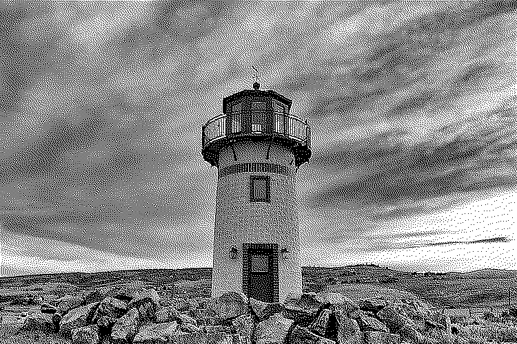

## Error Diffusion 

Error diffusion is another well known half-toning algorithm which focuses on the diffusion of
the error when calculated at a particular pixel to its neighboring pixels. The diffusion of error
to its neighboring pixel is achieved through three different diffusion matrices. The main
application of error diffusion method is to convert continuous-toned image to a binary, dual
tone image. The ability of diffusing the error to a new pixel which is not processed, produces
better local intensities, thus leading to a better enhanced binary image. Moreover, the filter
coefficients of the error diffusion matrix sums to one making the local value of output image
almost equal to the average value of input image.
The three different error diffusion method :
 - Floyd – Steinberg error diffusion method with 3x3 kernel
 - Jarvis, Judice and Nunke(JJN) error diffusion method with a 5x5 kernel
 - Error diffusion by Stucki using a 5x5 kernel

The different error diffusion method listed above also uses two different kind of scanning
procedure. It’s called serpentine scanning and razor scanning.

## Output 

#### Original Image:

#### Floyd - Steinberg Output: 

#### Jarvis, Judice and Nunke(JJN) Output: 

#### Stucki output 

