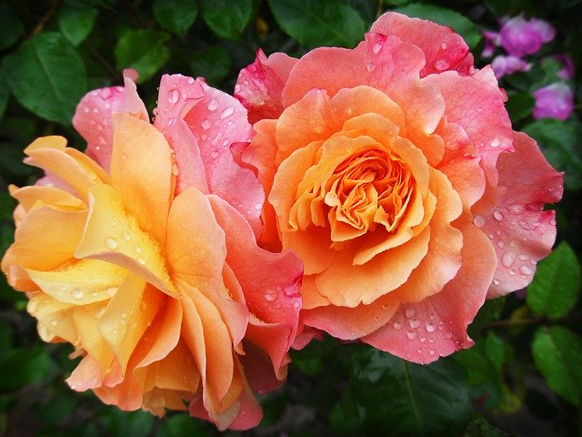

## Color Half-toning 

Like half-toning in gray-scale images, color half-toning is also possible which generates dots of
8 different colors. This is also an effective way to represent the colored images more
efficiently, thus preserving the maximum information from the image. This generates the
image which is useful in printing colored images. This part focuses on two different color
half-toning algorithms or methods. 

We know that a colored image can be represented by a 24-bit pixel value. The no of
combination in a way a color can be distributed goes in millions. In color half-toning, we
reduce the combinations to just 8 colors. The 8 color are: Blue, Magenta, Green, Cyan,
White, Black, Yellow, Green.

The separable error diffusion uses Floyd Steinberg error diffusion with serpentine scanning
for color half-toning. It converts the RGB to CMY color space and applies the error diffusion
matrix to quantize each channel separately. This is similar to the procedure used in error
diffusion method for half-toning gray-scale images, just that the three different channels
have to separated, processed in parallel and combine them into an RGB form. This method
requires the color space to be changed to CMY.

## Output 

#### Original Image:

#### Separable error diffusion half-toning 

