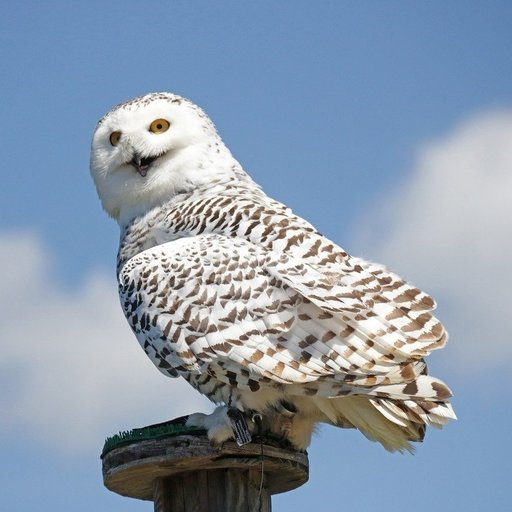

## Image Warping 

Image warping is a type of geometric transformation that introduces curvature into the mapping process. The introduction of curvature is important when an image has been distorted through lens aberrations and other non-linear processes. Warping transformations, also known as rubber sheet transformations, can arbitrarily stretch the image about defined points. This type of operation provides a nonlinear transformation between source and destination coordinates.

There are at least two ways to generate an image,

- **Forward Mapping** : a given mapping from sources to images is directly applied
- **Reverse Mapping** : for a given mapping from sources to images, the source is found from the image

## Output 

#### Original Hedwig Image:

 

#### Forward mapping warped output 

 

#### Reverse mapping output 

 