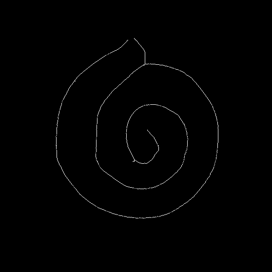
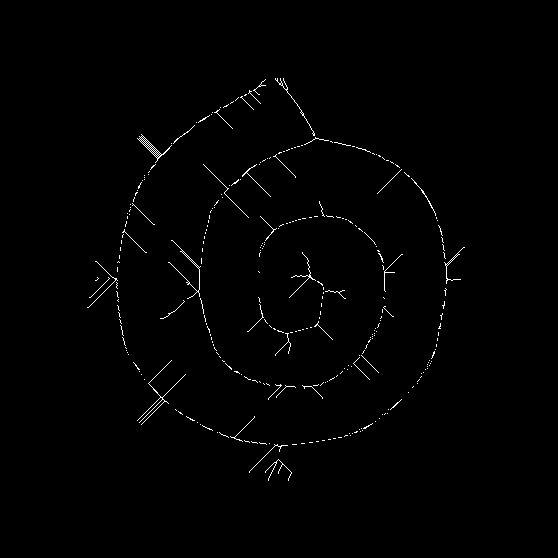

## Basic Morphological Process 

The basic three types of morphological operations covered are, 

### Shrinking 
  
This morphological operation reduces the image into a single point. During shrinking, the number of white pixels reduces drastically, and the black pixels increase. If an image contains a hole or round shape, it shrinks into a dot or ring.

#### Output 

 

### Thinning

This morphological operation is used to remove selected foreground pixels from the
binary images like an erosion or opening. This operation is related to the hit-and-miss transform. It is used to clear up the output of the edge detectors by thinning all the lines to single pixel thickness.

#### Output 

 

### Skeletonization

This morphological process reduces the foreground regions of the thresholded image to a skeletal image that preserves the edges, connectivity of the most foreground pixels in the image. This method preserves most of the image information and is least extreme in extracting morphological information.

#### Output 

 

  