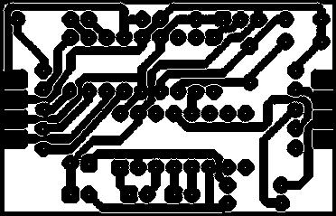

## PCB Analysis 

PCB analysis is another application of morphological operation where given an image of PCB, morphological operation can help to detect the number of holes and pathways present. This is an add on application to the counting problem where any of the morphological operation is helpful in preprocessing the image and finding the count of unique objects in the image.

Here we calculate two things, 

- Holes 
- Pathways 


## Output 

```
Hole count: 71
Number of pathways: 19
```

####  Original Image

 

#### Intermediate Image 

 