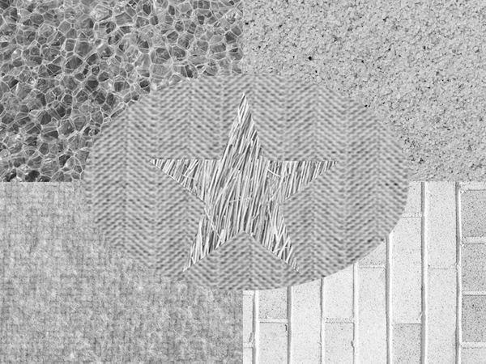
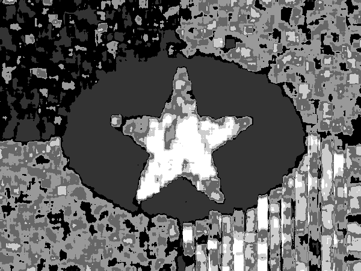

## Texture Segmentation

The next step is to perform texture segmentation using Law’s filter. We saw that these Law’s filters work well to classify the textures into different classes using any of the supervised or unsupervised learning methods. But texture segmentation is difficult compared to texture classification as segmenting the texture into different color intensities requires classification of each pixel of the texture. On the other end, it also involves segmentation of the different boundaries of the texture which needs to be identified parallel to the segmentation of the textures. As said, the process includes classification of the individual pixels (different region pixels in the same input image) and not the entire image. Texture segmentation is mainly done to support such applications like object and image recognition, as it segments different objects in the image along the texture. Texture segmentation also utilizes the unsupervised learning to segment the textures. It uses the K-Means clustering which clusters the textures by generating feature vectors and then utilizing the properties for the features to predict different color intensities pertaining to different clusters.

Dynamic texture segmentation is another different method used for segmentation. The problem of dynamic texture segmentation also lies in the same line of the problem of image texture segmentation. In case of image texture segmentation, we divide the image plane into regions of homogeneous spatial statistics. In case of dynamic image segmentation, we obtain similar partition, but make sure that we get homogeneous spatial and temporal statistics.

## Output 

#### Original Image 

#### Segmented Image 

